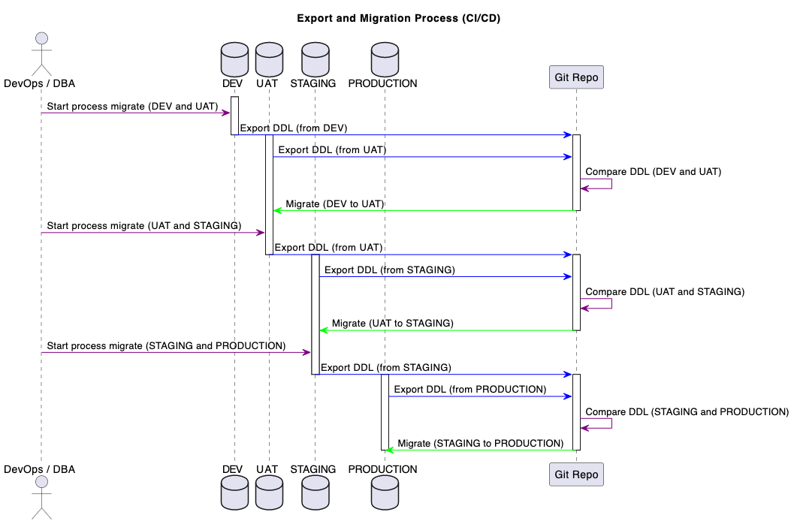

# FloStoreProcedureBE

This repository contains scripts to export and migrate SQL tables, functions, and procedures on Flo Database (MySQL) to different environments. The scripts are written in JavaScript and can be executed using Node.js.

## Installation

Before running the scripts, make sure you have Node.js and npm (Node Package Manager) installed. Then, follow these steps:

1.a Clone the repository:

  ```
  git clone https://github.com/LeftCoastLogic/FloStoreProcedureBE.git
  ```

1.b clone env
  ```
  cp .env.example .env
  ```

2. Navigate to the project directory:

cd FloStoreProcedureBE


3. Install the dependencies:

```
npm install
```

## Usage
- These scripts are used for exporting, comparing, and migrating data in different environments (local, dev, uat, stage, prod).
- Each script runs specific commands using the 'node andb' command line tool.
- The 'export' scripts export data for a specific environment, while the 'compare' scripts compare exported data.
- The 'migrate' scripts perform data migration based on the comparison results.
- The scripts are organized in a way that allows running them individually or in a sequence.

The following scripts are available for each environment: `DEV`, `UAT`, and `STAGE`.

Replace `<ENV>` with one of the following:

- `dev`: the development environment
- `uat`: the user acceptance testing environment
- `stage`: the staging environment
- `prod`: the production environment
  

## EXPORT
- To export full `DEV` run
  ```
  npm run export:dev
  ```
- To export full `UAT` run
  ```
  npm run export:uat
  ```
- To export full `STAGE` run
  ```
  npm run export:stage
  ```
  - To export full `PROD` run
  ```
  npm run export:prod
  ```
### Note: Export command help versioning all DDL

## COMPARE
- To compare `DEV` to get ready deploy to `UAT` run:
  - compare online
    ```bash
    npm run compare:uat
    ```
  - compare offline
    ```bash
    npm run compare:uat:off
    ```

- To compare `UAT` to get ready deploy to `STAGE` run:
  - compare online
    ```bash
    npm run compare:stage
    ```
  - compare offline
    ```bash
    npm run compare:stage:off
    ```

- To compare `STAGE` to get ready deploy to `PROD` run:
  - compare online
    ```bash
    npm run compare:prod
    ```
  - compare offline
    ```bash
    npm run compare:prod:off
    ```
### Note: Compare command will automatic trigger export SOURCE and DESTINATION environment


## MIGRATE
  ### Note: 
    - Make sure the compare command has already ran before migrate
    - Indirect migrate do not trigger to deprecated process, it only allow done via direct command only
  
A.  To migrate `DEV` to `UAT` run:
  - Compare then migrate
    ```
    npm run migrate:uat
    ```
  - Direct migrate, WARNING: **only use it if u already compare before**
    - migrate all new for UAT
      ```
      npm run migrate:uat:new
      ```
    - migrate all updated for UAT
      ```
      npm run migrate:uat:updated
      ```
    - remove all deprecated FUNCTION and PROCEDURE for UAT
      ```
      npm run migrate:uat:deprecated
      ```
B. To migrate `UAT` to `STAGE` run:
  - Compare then migrate
    ```
    npm run migrate:stage
    ```
  - Direct migrate, WARNING: **only use it if u already compare before**
    - migrate all new for UAT
      ```
      npm run migrate:stage:new
      ```
    - migrate all updated for UAT
      ```
      npm run migrate:stage:updated
      ```
    - remove all deprecated FUNCTION and PROCEDURE for STAGE
      ```
      npm run migrate:stage:deprecated
      ```
C. To migrate `STAGE` to `PROD` run:
  - Compare then migrate
    ```
    npm run migrate:prod
    ```
  - Direct migrate, WARNING: **only use it if u already compare before**
    - migrate all new for UAT
      ```
      npm run migrate:prod:new
      ```
    - migrate all updated for UAT
      ```
      npm run migrate:prod:updated
      ```
    - remove all deprecated FUNCTION and PROCEDURE for PROD
      ```
      npm run migrate:prod:deprecated
      ```
## Issues

If you encounter any issues or have suggestions for improvement, please visit the [issue tracker](https://github.com/LeftCoastLogic/FloStoreProcedureBE/issues) to report them.
