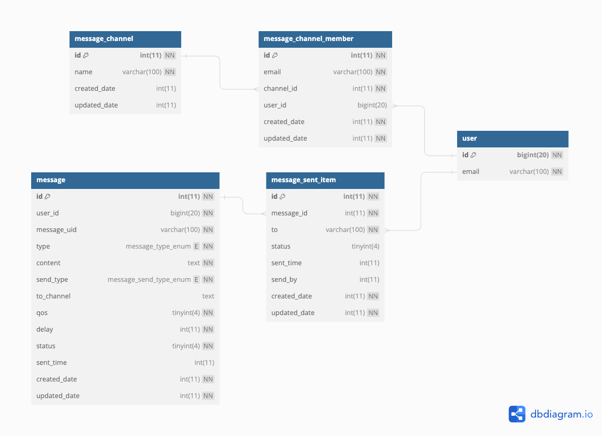

# BE | Notification Service
Notification Service
## Install and Start
- Config
  ```
  - copy env.example to .env
  - update config in .env
  ```
- Install dependency
  ```
  npm i
  ```
- Start on Dev
  ```
  npm run start:dev
  ```
## Start with docker-compose
- none scale notification service
  ```
  docker compose up -d
  ```
- scale notification service
  ```
  docker compose up -d --scale dev=4
  ```
- API endpoint: http://localhost:8080
## Functions
- Build a websocket IO to send notification/events to client
  - Follow websocket IO document here : https://socket.io/
- Notification/event sending function
    - 1/ Can send to 1 channel - users on the same channel will receive it
    - 2/ Can broadcast message - send to everyone
    - 3/ Can be sent to all clients logged in on the web or all clients logged in on IPHONE/IPAD/MAC/...
    - 4/ Can send to 1 user or many users
    - 5/ Can be sent as a delay - how many seconds will it take to send to the client
    - 6/ Ability to automatically send when the client is online - if there is a sending error because the user is offline, the system will automatically send again after the user is online again.
    - 7/ Message history can be stored or not depending on the options selected when sending the message.
- Create an API to manage channels and send messages
   
## Concept and Design
### Oveview and Usercases
  

### Message Type
  - There are two type message: EVENT and NOTIFICATION
  - EVENT type: using for BE system send event to client, help client get status resource of BE system, for example : Meeting Event, Create Collection Event, ..., after that, client can using this event information to process the next step
  - NOTIFICATION type: Helps notify the client of information, information that the client only uses to display for the user to see, and the client does not take any action on that information.

### Send Type
  - There are three type of send : USER, CHANNEL, BROADCAST
    - USER: send to clients of specific users
    - CHANNEL: send to all client of users belong a CHANNEL
    - BROADCAST: send to all client
    - Reference Messsage Parterns bellow
  
### Message Parterns
  

### Message QoS (Quality of Service)
  - QoS = 0 : Only send one time
  - QoS = 1 : Make sure the client receives the message before sending it
  - Default QoS = 1
  
### Message Delay
- Delay send in time (seconds)
- Default delay is 0 seconds (send immediately)

### Channels
- This is a group of users, using for send message to all user belong to the channel.
- You can create channel via Notifcation API

### System Channel
-  This is channel manager by Notification system, you can not create, remove or add member on those channels. 
-  The system channel include: web, iphone

### Websocket IO Provider design
- This is websocket server base on **Websocket IO version 4.6.2**: https://socket.io/docs/v4/
- **Auth**: When Client connect to websocket server, the server using access token, app_id and device_uid to verify client. Server will be not auto disconnect if access token expired, but if client use access token which expired, Websocket will reject connection.
- The main concept of websocket is one way, only way send message from server to client, not client to server (except some case specicals)
- ```pingInterval``` and ```pingTimeout```:
  - This value is used in the heartbeat mechanism, which periodically checks if the connection is still alive between the server and the client.
The server sends a ping packet every pingInterval ms, and if the client does not answer with a pong within pingTimeout ms, the server considers that the connection is closed.  
  - ```pingInterval``` default value is 25000 ~ 25 seconds
  - ```pingTimeout``` default value is 20000 ~ 20 seconds
- To custom more, please refer more websocket io server option here: https://socket.io/docs/v4/server-options
- You can scale out websocket by create adapter redis io. Current source code have not implement use Redis Io adapter, to scale out you should using redis io adapter follow code here: https://docs.nestjs.com/websockets/adapter

### Database design

- **1/ Notification table (notification)**
  - This is a table use for storing message, help keep message history and message un-sent
    ```SQL
        CREATE TABLE `notification` (
            `id` int(11) NOT NULL AUTO_INCREMENT,
            `message_id` varchar(100) NOT NULL,
            `type` enum('NOTIFICATION','EVENT') NOT NULL,
            `content` text CHARACTER SET utf8mb4 COLLATE utf8mb4_bin NOT NULL COMMENT 'because have not function search messaege , so I design it json format',
            `send_type` enum('CHANNEL','USER','BROADCAST') NOT NULL,
            `to_channel` text DEFAULT NULL COMMENT 'channel id',
            `qos` tinyint(4) NOT NULL DEFAULT 0 COMMENT '0: only send 1 time, 1: alway send unit user readed',
            `delay` int(11) NOT NULL DEFAULT 0 COMMENT 'time second delay send',
            `status` tinyint(4) NOT NULL DEFAULT 0 COMMENT '1: sent; 0: unsend',
            `sent_time` int(11) DEFAULT NULL,
            `created_date` int(11) NOT NULL,
            `updated_date` int(11) NOT NULL,
            `created_by` int(11) NOT NULL DEFAULT 0,
            PRIMARY KEY (`id`),
            UNIQUE KEY `notification_UN` (`message_id`)
        ) ENGINE=InnoDB DEFAULT CHARSET=utf8 COLLATE=utf8_general_ci;
    ```
- **2/ Notification send item (notification_send_item)**
  - This is table storing status send of each user
  ```SQL
        CREATE TABLE `notification_send_item` (
            `id` int(11) NOT NULL AUTO_INCREMENT,
            `message_id` varchar(100) NOT NULL,
            `to` varchar(50) NOT NULL,
            `status` tinyint(4) DEFAULT NULL COMMENT '0. unsent, 1. sent, 2. readed',
            `sent_time` int(11) DEFAULT NULL,
            `send_by` int(11) DEFAULT NULL COMMENT '0: send by system',
            `created_date` int(11) NOT NULL,
            `updated_date` int(11) NOT NULL,
            PRIMARY KEY (`id`),
            KEY `notification_status_to_IDX` (`to`) USING BTREE
        ) ENGINE=InnoDB DEFAULT CHARSET=utf8 COLLATE=utf8_general_ci;
  ```
- **3/ Notification channel (notification_channel)**
  - This is table storing the channels of users, you need create a channel before send message to a channel.
  - The system channel NOT store in this table
    ```SQL
        CREATE TABLE `notification_channel` (
            `id` int(11) NOT NULL AUTO_INCREMENT,
            `name` varchar(100) NOT NULL,
            `created_date` int(11) DEFAULT NULL,
            `updated_date` int(11) DEFAULT NULL,
            PRIMARY KEY (`id`),
            UNIQUE KEY `notification_channel_UN` (`name`)
        ) ENGINE=InnoDB DEFAULT CHARSET=utf8 COLLATE=utf8_general_ci;
    ```
- **4/ Notification channel member (notification_channel_member)**
  - Thi is table to link many - many between member and channel
    ```SQL
        CREATE TABLE `notification_channel_member` (
            `id` int(11) NOT NULL AUTO_INCREMENT,
            `user_email` varchar(100) NOT NULL,
            `channel_id` int(11) NOT NULL,
            `created_date` int(11) NOT NULL,
            `updated_date` int(11) NOT NULL,
            PRIMARY KEY (`id`),
            UNIQUE KEY `notification_channel_member_UN` (`user_email`,`channel_id`),
            KEY `notification_channel_member_channel_id_IDX` (`channel_id`) USING BTREE
        ) ENGINE=InnoDB DEFAULT CHARSET=utf8 COLLATE=utf8_general_ci;
    ```
### API inteface
 - **1/ Channel**
      - 1.1/ Create channel with members
        - POST /channels
        - Body: 
            ```json
                {
                    "name": "channel02",
                    "members": [
                        "cong_tran@flodev.net",
                        "thieulq@flodev.net"
                    ]
            }
            ```
        - Response cases:
            - Success response: 
                ```json 
                {
                    "data": {
                        "channel": {
                            "messsage": "add channel success",
                            "name": "channel02"
                        },
                        "member_error": [],
                        "member_sucess": [
                            "cong_tran@flodev.net",
                            "thieulq@flodev.net"
                        ]
                    }
                }
                ```
            - Error duplicate response: 
                ```json
                    {
                        "statusCode": 400,
                        "message": "Error duplicated channel",
                        "error": "Bad Request"
                    }
                ```
            - Error channel name invalid
                ```json
                {
                    "error": {
                        "message": "name must match /^[a-zA-Z0-9-_]+$/ regular expression; ",
                        "code": "BadRequest",
                        "attributes": "name"
                    }
                }  
                ```
      - 1.2/ get list channels - get all channels or filter by user
          - GET /channels
          - Response: 
            ```json 
            {
                "data": [
                    "channel02",
                    "channel03"
                ]
            }
            ``` 
      - 1.3/ Get list of members of a channel
          - GET /channels/:channelName/members
          - Response:
             ```json
             {
                "data": [
                    "cong_tran@flodev.net",
                    "thieulq@flodev.net",
                    "quangadmin_dev_member@flodev.net"
                ]
            }
            ```
      - 1.4/ Add list members to a channel
          - POST /channels/:channelName/members
          - Body: 
            ```json
            {
                "members": [
                    "quangadmin_dev_member@flodev.net"
                ]
            }
            ```
          - Response:
            ```json
            {
                "data": {
                    "member_error": [],
                    "member_sucess": [
                        "quangadmin_dev_member@flodev.net"
                    ]
                }
            }
            ```
      - 1.5/ Delete list members from a channel
          - DELETE /channels/:channelName/members
          - Body: 
            ```json
            {
                "members": [
                    "thieulq@flodev.net"
                ]
            }
            ```
          - Response:
            ```json 
            {
                "data": {
                    "member_error": [],
                    "member_sucess": [
                        "thieulq@flodev.net"
                    ]
                }
            }
            ```
      - 1.6/ Delete a member from a channel
          - DELETE /channels/:channelName/members/:email
            Response:
            ```JSON
            {
                "data": {
                    "member_error": [],
                    "member_sucess": [
                        "thieulq@flodev.net"
                    ]
                }
            }
            ```
      - 1.7/ Delete 1 channel
          - DELETE /channels/:channelName
          - Response:
            ```JSON
            {
                "data": {
                    "channel_deleted": true,
                    "member_channel_deleted": true
                }
            }
            ```
    - **2/ Messages**
        - 2.1 Send messages
            - POST messages/send
            - Body
            ```JSON
            {
                "event_type": "[NOTIFICATION|EVENT]",,
                "content": "Hello",
                "persistence": "[NONE_PERSISTENCE|PERSISTENCE]",
                "to": "[user_email|channel]",
                "send_type": "[CHANNEL|USER|BROADCAST]",
                "delay": [seconds],
                "qos": [1|0]
            }
            ```
        - **content**: The content of the message.
            persistence: Boolean that controls whether the message is persisted on the back end.
        - **event_type**: The event_type of message, NOTIFICATION or EVENT.
        - **delay**: Set time to delay send to client.
        - **send_type**: The type of group client need to message, CHANNEL or USER or BROADCAST.
        - **to**: 
            - If you set send_type = CHANNEL, the field [to] is a channel or many channels
            - If you set send_type = USER, the field [to] is a user or list of users
            - If you set send_type = BROADCAST, the field [to] need to not set
        - **qos**: 
          - QoS = 0 : Only send one time
          - QoS = 1 : Make sure the client receives the message before sending it
          - Default QoS = 1
        - Response: 
        ```JSON
        {
            "data": [
                {
                    "email": "cong_tran@flodev.net",
                    "status": true
                },
                {
                    "email": "thieulq@flodev.net",
                    "status": true
                },
                {
                    "email": "quangadmin_dev_member@flodev.net",
                    "status": true
                }
            ]
        }
        ```
        - 2.2 History message -> only messages with the option "persistence": "PERSISTENCE" will be saved
            - GET /messages
            - Header:
                ```
                app_id:{{app_id}}
                device_uid:{{device_uid}}
                authorization:Bearer {{access_token}}
                ``` 
            - Response: 
                ```JSON
                [
                    {
                        "message_id": "6e223cab-33ec-4269-a357-8c06f0825939",
                        "content": "hello channel01",
                        "type": "NOTIFICATION",
                        "send_type": "CHANNEL",
                        "to_channel": "channel01",
                        "qos": 0,
                        "delay": 0,
                        "status": 1,
                        "sent_time": 1699929080
                    },
                    {
                        "message_id": "2b182521-2f07-43b2-8bd1-cd6cf577ed98",
                        "content": "hello channel02",
                        "type": "NOTIFICATION",
                        "send_type": "CHANNEL",
                        "to_channel": "channel02",
                        "qos": 0,
                        "delay": 0,
                        "status": 1,
                        "sent_time": 1699930654
                    },
                    {
                        "message_id": "70665a77-a3ac-439a-9cf8-0ee93da46c9b",
                        "content": "hello channel02",
                        "type": "NOTIFICATION",
                        "send_type": "CHANNEL",
                        "to_channel": "channel02",
                        "qos": 0,
                        "delay": 0,
                        "status": 1,
                        "sent_time": 1699930822
                    }
                ]
                ```
        - 2.3 Get list of users who are online
            - GET /messages/users/status?email=:email
                - Param email is not required
            - Response:
                ```json
                [
                    {
                        "user_id": 92754,
                        "socket_client_id": "BdB_9qaHBAn0X04eAAAB",
                        "email": "cong_tran@flodev.net",
                        "app_id": "e70f1b125cbad944424393cf309efaf0",
                        "device_uid": "cd111a93-a3b3-4625-bafe-1cc9e25d7541",
                        "source_ip": "::ffff:127.0.0.1",
                        "time": 1699958626349,
                        "time_string": "Tue Nov 14 2023 17:43:46 GMT+0700 (Indochina Time)"
                    },
                    {
                        "user_id": 45975,
                        "socket_client_id": "8UMjjg6BSgN4YX1dAAAV",
                        "email": "thieulq@flodev.net",
                        "app_id": "e70f1b125cbad944424393cf309efaf0",
                        "device_uid": "cd111a93-a3b3-4625-bafe-1cc9e25d7541",
                        "source_ip": "::ffff:127.0.0.1",
                        "time": 1699958682777,
                        "time_string": "Tue Nov 14 2023 17:44:42 GMT+0700 (Indochina Time)"
                    }
                ]
                ```
### Client Integrate
#### Javascript
```javascript
import { io } from "./basic-client.js";

const socket = io();

// connection
socket.on("connect", () => {
  // ...
});
// receiving HELLO event type
socket.on("HELLO", (value) => {
  // ...
});
// receiving NOTIFICATION event type
socket.on("NOTIFICATION", (value) => {
  // ...
});

// receiving EVENT event type
socket.on("EVENT", (value) => {
  // ...
});

// sending a message to server to NOTIFICATION event type
socket.emit("NOTIFICATION", "hello world");

// sending a message to server to EVENT event type
socket.emit("EVENT", "hello world");
```
- Reference more here : 
  - https://socket.io/how-to/build-a-basic-client
  - Source code: https://github.com/socketio/socket.io/tree/main/examples/basic-websocket-client